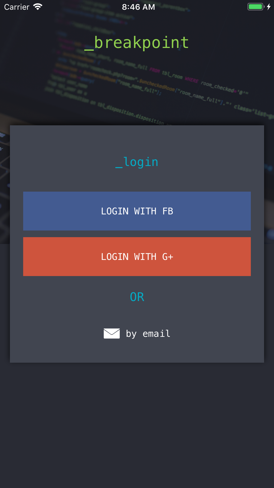
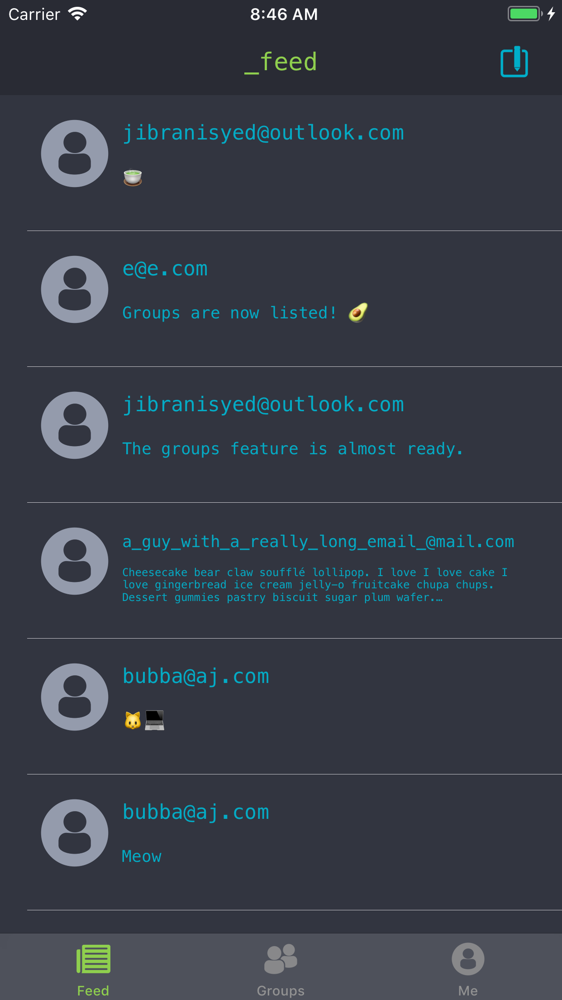
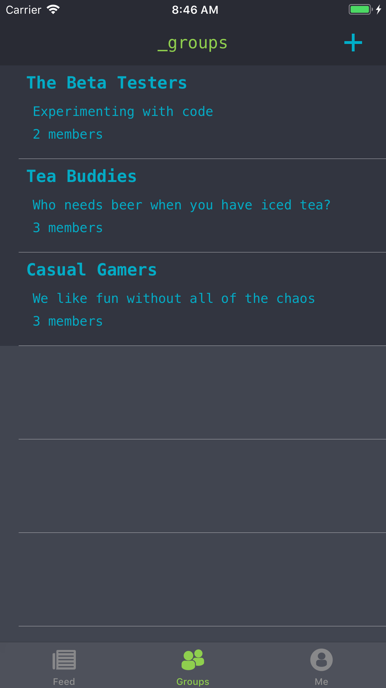
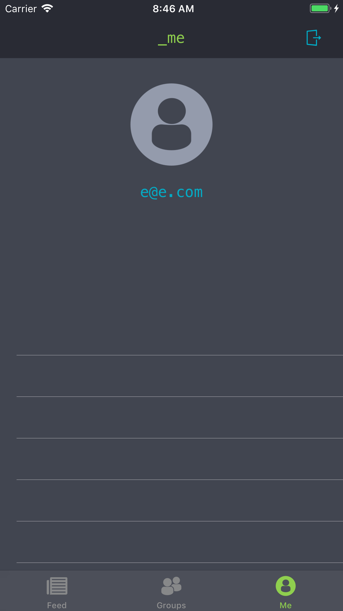
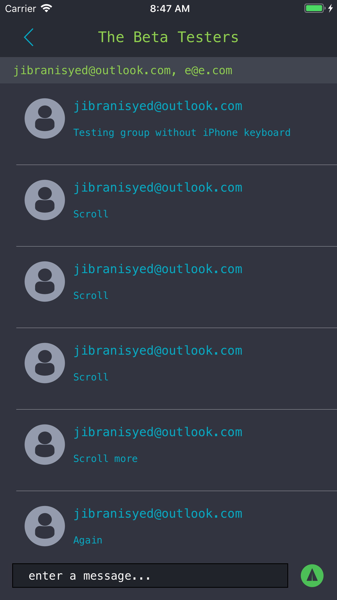

# DevSlopesProj-Breakpoint
A micro social network iOS app demo aimed for coders and other geeks

Written for the iOS 11 development course from DevSlopes. The backend is powered by Firebase. The app features a global feed where all users can post, and chat groups where only select users can post. Not all features are currently available, like social logins and profile screen.

The project requires certain Cocoapod libraries, see the Podfile for more information.

The app icon was made by me.

